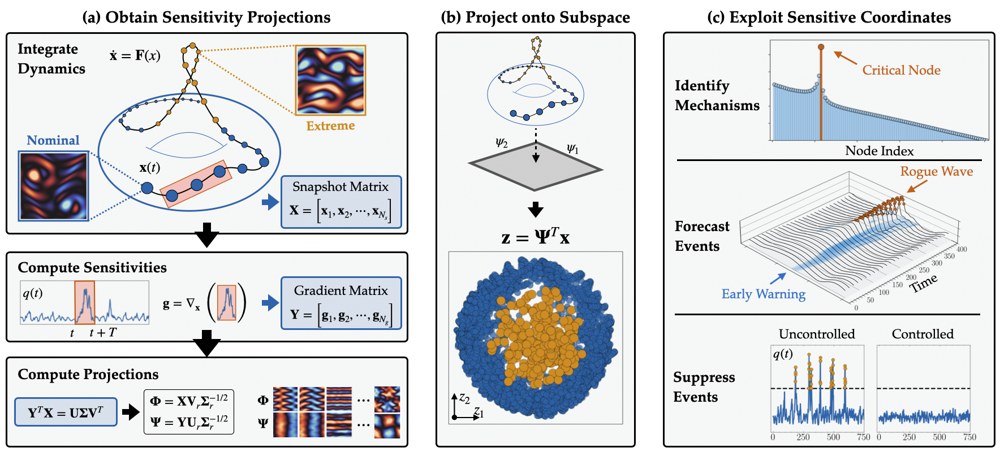

# Uncovering Extreme Event Mechanisms for Prediction and Control with Sensitivity-Balanced Projections


This repository serves as the home for the code accompanying ``Uncovering Extreme Event Mechanisms for Prediction
and Control with Sensitivity-Balanced Projections'' by Nicholas Zolman, Sajeda Mokbel, Samuel E. Otto, and Steven L. Brunton.


## Data
Accompanying data can be found here: https://huggingface.co/datasets/nzolman/cobras_extreme


## Running The Kolmogorov Flow
To run the Kolmogorov flow examples, you need to include [Controlling-Kolmogorov-Flow](https://github.com/smokbel/Controlling-Kolmogorov-Flow) as a directory in the root of this folder:

```
Controlling-Kolmogorov-Flow/
src/
...
.gitignore

```

